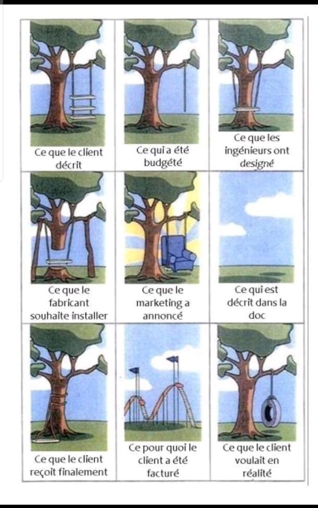
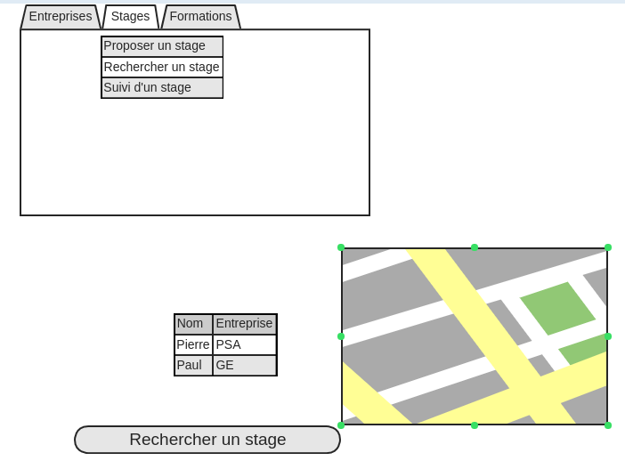

<link rel="stylesheet" type="text/css" href="https://github.com/amillet90/Projet_tut/blob/master/css/markdown-pandoc-amV2.css">

# Projet Tuteuré 

## Cahier des charges

## structure de données du projet

* **Modèle Conceptuel de Données(MCD)**

 

* **Modèle Logique de données(MLD)**

 

* **Diagramme de relation entre les entités (Entity Relationship diagram:ERD)**

## Principales interfaces du projet

* sur mobile <https://mockflow.com/>
* sur écran <https://gomockingbird.com/mockingbird/> ?

## Menu

<https://www.gloomaps.com/>
<https://graphiste.com/blog/logiciels-mind-mapping-gratuits>

## Aspect sécurité/authentification

* stratégies :

# Divers

[article sur le markdown](articles/doc_markdow.md)

 
## présentation de Git

[article sur le markdown](articles/doc_git.md)

